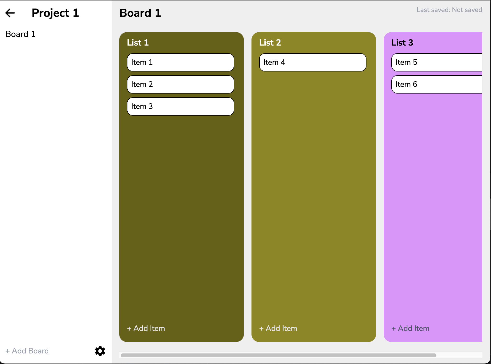

# Kanban Board



A **completely offline**, multi-platform Kanban Board built with [Tauri v2](https://tauri.app/) and React.  
Designed for individual use, this app lets you organize tasks and projects visually, with no cloud or account required.

---

## Features

- **Completely Offline:** All data is stored locally, no internet required.
- **Multi-platform:** Runs on Windows, macOS, and Linux.
- **Fast & lightweight:** Built with Tauri v2 and Rust for performance.
- **Drag-and-drop:** Easily move tasks between lists.
- **Customizable:** Add, edit, delete and customize the color of boards, lists, and items.

## Getting Started

### Prerequisite

- **Node.js & npm:**  
  [Install Node.js and npm](https://docs.npmjs.com/downloading-and-installing-node-js-and-npm)
- **Rust toolchain:**  
  [Install Rust](https://www.rust-lang.org/tools/install)

### Building

1. **Clone the repository:**

   ```bash
   git clone https://github.com/shr00m335/kanban-board.git
   cd kanban-board
   ```

2. **Install dependencies:**

   ```bash
   npm install
   ```

3. **Build the application:**

   ```bash
   npm run tauri build
   ```

4. **Run in development mode (optional):**
   ```bash
   npm run tauri dev
   ```
